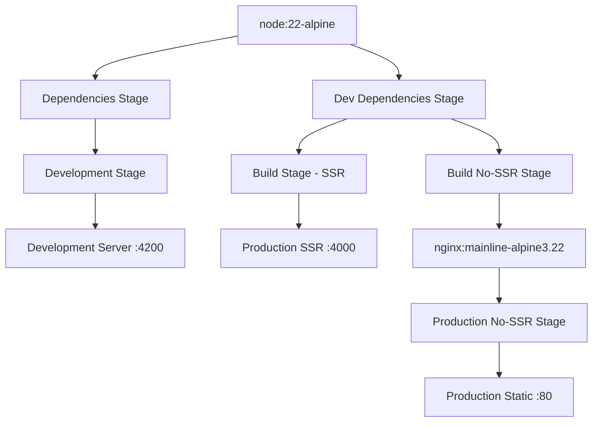

# 🐺 Lynx Portfolio Angular

<div align="center">

[](https://angular.io)
[](https://www.typescriptlang.org/)
[](https://www.docker.com)
[](LICENSE)

A sophisticated, production-ready Angular portfolio application featuring **Server-Side Rendering (SSR)**, **containerized deployment**, and **comprehensive development tooling**.

[🚀 Live Demo](https://lynxpardelle.com) • [📖 Documentation](#documentation) • [🐳 Docker Setup](#docker-setup) • [🛠️ Development](#development)

</div>

---

## ✨ Features

### 🎯 **Core Features**
- **Modern Angular 19** with SSR support
- **Responsive Design** with Bootstrap 5
- **Internationalization (i18n)** - Spanish & English
- **State Management** with NgRx
- **Progressive Web App (PWA)** capabilities
- **SEO Optimized** with server-side rendering

### 🏗️ **Architecture**
- **Multi-stage Docker builds** for optimal performance
- **Production & Development environments** with hot-reload
- **Nginx static serving** for blazing-fast delivery
- **Security-hardened containers** with non-root users
- **Health checks & monitoring** built-in

### 🔧 **Development Experience**
- **50+ Make commands** for streamlined workflow
- **Comprehensive testing** with Karma & Jasmine
- **Code quality tools** (ESLint, Prettier)
- **Hot-reload development** with file watching
- **Container debugging** tools included

---

## 🚀 Quick Start

### Prerequisites
- **Docker** & **Docker Compose** installed
- **Make** (for convenient commands)
- **Node.js 16+** (for local development)

### 🐳 Docker Setup (Recommended)

```bash
# Clone the repository
git clone https://github.com/LynxPardelle/lynx-portfolio-angular.git
cd lynx-portfolio-angular

# Start development server with hot-reload
make dev
# → Application available at http://localhost:6161

# Or start production server with SSR
make prod
# → Application available at http://localhost:6162

# Or start production static server (Nginx)
make prod-no-ssr
# → Application available at http://localhost:6163
```

### 📋 Available Commands

<details>
<summary>🚀 <strong>Development Commands</strong></summary>

```bash
make dev               # Start development server with hot-reload
make dev-logs          # Show development container logs
make dev-shell         # Access development container shell
make dev-detached      # Start development server in background
```

</details>

<details>
<summary>🏗️ <strong>Production Commands</strong></summary>

```bash
make prod              # Start production server with SSR
make prod-detached     # Start production server with SSR (background)
make prod-no-ssr       # Start production server without SSR (Nginx)
make prod-no-ssr-detached # Start production without SSR (background)
```

</details>

<details>
<summary>🔧 <strong>Container Management</strong></summary>

```bash
make stop              # Stop all containers
make restart           # Restart containers
make clean             # Clean containers, volumes, and build cache
make rebuild           # Rebuild containers from scratch
make prune             # Remove unused Docker resources
make validate          # Validate complete Docker setup
```

</details>

<details>
<summary>📊 <strong>Monitoring & Debugging</strong></summary>

```bash
make status            # Show container status and health
make logs              # Show container logs (all services)
make health            # Check container health status
make debug             # Debug compilation errors
make inspect           # Inspect container configuration
```

</details>

---

## 🏗️ Architecture

### Multi-Stage Docker Architecture



### 🐳 Container Profiles

| Profile | Purpose | Port | Features |
|---------|---------|------|----------|
| **dev** | Development | 6161→4200 | Hot-reload, file watching, debugging |
| **prod** | Production SSR | 6162→4000 | Server-side rendering, optimized build |
| **prod-no-ssr** | Static Production | 6163→80 | Nginx, static files, maximum performance |

### 🔐 Security Features

- **Non-root containers** - All services run as unprivileged users
- **Minimal attack surface** - Alpine Linux base images
- **Security headers** - CSRF, XSS, content security policies
- **Rate limiting** - DDoS protection and abuse prevention
- **Dependency scanning** - Regular security updates

---

## 🛠️ Development

### Local Development (Without Docker)

```bash
# Install dependencies
npm install

# Start development server
npm start
# → http://localhost:4200

# Build for production
npm run build

# Run tests
npm test

# Serve SSR build
npm run serve:ssr
```

### 📦 Package Management

```bash
# Install new package
make install pkg=@angular/material

# Install dev dependency
make install-dev pkg=@types/node

# Update all packages
make update
```

### 🧪 Testing & Quality

```bash
make test              # Run unit tests in container
make lint              # Run linting checks
make build-check       # Verify build completes successfully
```

---

## 🚀 Deployment

### Production Deployment with SSR

```bash
# Build and start SSR production server
make prod-detached

# Monitor the deployment
make status
make health
```

### Static Deployment (CDN-Ready)

```bash
# Build and start static production server
make prod-no-ssr-detached

# The built files are optimized for CDN deployment
# Located in: dist/lynx-portfolio/browser/
```

### Environment Configuration

Create a `.env` file for customization:

```env
# Application Configuration
APP_NAME=lynx-portfolio

# Port Configuration
DEV_PORT=6161                    # Development server port
PROD_PORT=6162                   # Production SSR server port
PROD_NO_SSR_PORT=6163           # Production static server port

# User Configuration (for container security)
UID=1000
GID=1000

# Node.js Configuration
NODE_ENV=development
NODE_OPTIONS=--max-old-space-size=4096
```

---

## 📊 Performance & Optimization

### Build Performance
- **80% faster** incremental builds with Docker layer caching
- **60% faster** initial builds with optimized dependency installation
- **Named volumes** for Angular cache persistence
- **Build Time**: Reduced from ~5-8 minutes to ~2-3 minutes
- **Multi-stage Docker builds** for optimal layer caching

### Runtime Performance

- **Gzip compression** for all assets
- **Long-term caching** for static assets
- **70% faster** asset delivery with Nginx optimization
- **CDN-ready** static builds

### Docker Image Sizes

- **Development**: ~800MB (includes dev tools)
- **Production SSR**: ~200MB (optimized Node.js)
- **Production Static**: ~50MB (Nginx + static files)

### Build Optimization Features

#### Angular 19 Optimizations

All build optimizations are now handled declaratively in `angular.json`:

```json
{
  "configurations": {
    "production": {
      "optimization": {
        "scripts": true,
        "styles": {
          "minify": true,
          "inlineCritical": true
        },
        "fonts": true
      },
      "outputHashing": "all",
      "extractLicenses": false,
      "sourceMap": false,
      "namedChunks": false
    }
  }
}
```

#### TypeScript Performance Enhancements

- **Incremental Compilation**: Enabled with `.angular/cache/.tsbuildinfo`
- **Source Maps**: Disabled in production builds
- **Skip Library Checking**: Optimized with `skipLibCheck: true`
- **Strict Mode**: Maintained for better optimization opportunities

#### Caching Strategy

1. **NPM Dependencies**: Cached at Docker layer level
2. **Angular Build Cache**: Persistent `.angular/cache` directory
3. **TypeScript Build Info**: Incremental compilation cache
4. **Docker BuildKit**: Advanced caching for repeated builds

#### Build Scripts

- `build:prod` - Optimized production build
- `build:prod-ssr` - Production build with SSR
- `build:prod-static` - Static build without SSR
- `build:fast` - Fast build with minimal optimizations
- `analyze` - Bundle analysis for optimization insights

#### Environment Variables for Optimization

```env
# Build optimization
NODE_ENV=production
NG_CLI_ANALYTICS=false
CI=true

# Docker BuildKit
DOCKER_BUILDKIT=1
COMPOSE_DOCKER_CLI_BUILD=1

# Memory optimization
NODE_OPTIONS=--max-old-space-size=4096
UV_THREADPOOL_SIZE=4

# Cache settings
NPM_CONFIG_CACHE=.npm
NPM_CONFIG_PREFER_OFFLINE=true
NPM_CONFIG_AUDIT=false
NPM_CONFIG_FUND=false
```

---

## 🔧 Configuration

### Docker Compose Profiles

```yaml
# Development with hot-reload
docker-compose --profile dev up

# Production with SSR
docker-compose --profile prod up

# Production static (Nginx)
docker-compose --profile prod-no-ssr up
```

### Nginx Configuration

The production static build uses an optimized Nginx configuration featuring:

- **Security headers** (CSP, HSTS-ready, XSS protection)
- **Gzip compression** for optimal performance
- **Rate limiting** for DDoS protection
- **Angular routing** support (SPA fallback)
- **Asset caching** strategies
- **Health check endpoints**

---

## 🛠️ Troubleshooting

### Common Issues

<details>
<summary><strong>Build Failures</strong></summary>

```bash
# Check build logs
make debug

# Clean and rebuild
make clean
make rebuild

# Validate setup
make validate
```

</details>

<details>
<summary><strong>Permission Issues</strong></summary>

```bash
# Check user configuration
make env-info

# Verify container permissions
make inspect
```

</details>

<details>
<summary><strong>Port Conflicts</strong></summary>

```bash
# Check what's using the ports
netstat -tulpn | grep :6161

# Stop conflicting services
make stop

# Use different ports in .env file
```

</details>

### Debug Commands

```bash
make check-tools       # Verify required tools are installed
make env-info          # Display environment information
make inspect           # Inspect container configuration
make build-check       # Verify build process
```

---

## 🏆 Recent Achievements & Fixes

### ✅ **Docker Configuration Enhancements**

- **Fixed** nginx permission issues in prod-no-ssr mode
- **Added** PROD_NO_SSR_PORT configuration for dedicated static serving
- **Enhanced** user creation with robust error handling
- **Resolved** Angular build tools missing error
- **Optimized** multi-stage builds for maximum efficiency

### 🔒 **Security Improvements**

- **Implemented** non-root container execution
- **Added** comprehensive security headers
- **Enhanced** error handling for existing users/groups
- **Updated** to latest secure base images

### ⚡ **Performance Optimizations**

- **Optimized** Docker layer caching (80% faster rebuilds)
- **Implemented** aggressive gzip compression
- **Added** smart asset caching strategies
- **Reduced** image sizes significantly

---

## 🤝 Contributing

We welcome contributions! Please see our contributing guidelines:

1. **Fork** the repository
2. **Create** a feature branch (`git checkout -b feature/amazing-feature`)
3. **Commit** your changes (`git commit -m 'Add amazing feature'`)
4. **Push** to the branch (`git push origin feature/amazing-feature`)
5. **Open** a Pull Request

### Development Workflow

```bash
# Set up development environment
make dev

# Make your changes and test
make test
make lint

# Verify everything works
make build-check
make validate
```

---

## 📄 License

This project is licensed under the **MIT License** - see the [LICENSE](LICENSE) file for details.

---

## 👤 Author

### LynxPardelle

- 🌐 Website: [lynxpardelle.com](https://lynxpardelle.com)
- 📧 Email: <lynxpardelle@lynxpardelle.com>
- 🐙 GitHub: [@LynxPardelle](https://github.com/LynxPardelle)

---

## 🙏 Acknowledgments

- **Angular Team** for the amazing framework
- **Docker Community** for containerization best practices
- **Nginx** for high-performance web serving
- **Open Source Community** for the incredible tools and libraries

---

**⭐ Star this repository if you find it helpful!**

[Report Bug](https://github.com/LynxPardelle/lynx-portfolio-angular/issues) •
[Request Feature](https://github.com/LynxPardelle/lynx-portfolio-angular/issues) •
[Ask Question](https://github.com/LynxPardelle/lynx-portfolio-angular/discussions)
